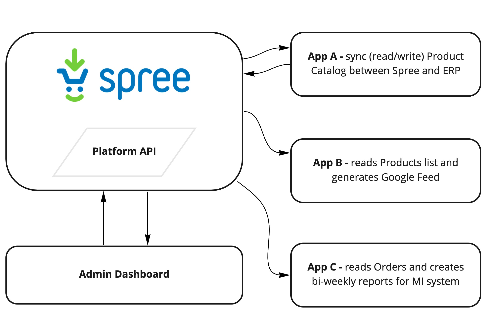

# Headless Commerce


## Spree APIs

Spree is a modular, API-first headless e-commerce platform that consists of several APIs.

### [Storefront API](https://api.spreecommerce.org/docs/api-v2/YXBpOjMxMjQ5NjA-storefront-api-v2)

* Modern and lightweight REST API based on JSON API schema
* Designed for building Storefronts and mobile apps
* [JavaScript / TypeScript SDK](https://github.com/spree/spree-storefront-api-v2-js-sdk) available
* Next.js Commerce and VueStorefront integrations will be released soon! 

### [Platform API](https://api.spreecommerce.org/docs/api-v2/YXBpOjg3MzkxODk-platform-api-v2) \(Developer Preview\)



* OAuth 2.0 authentication
* designed for building application to application integration
* permission sets based access to resources
* access any resource on the Spree platform and perform any action

### Webhooks

We're working hard to deliver webhooks in the [next release](https://github.com/spree/spree/milestone/45)!

## Storefronts

Spree allows limitless storefront customization. 

You can build your own storefront from scratch using our [SDK](https://github.com/spree/spree-storefront-api-v2-js-sdk) which takes care of all heavy lifting tasks, or you can use [Next.js Commerce](https://nextjs.org/commerce) or [Vue Storefront](https://www.vuestorefront.io/). 

For Next.js/Vue Storefront integration [please contact us directly](https://spreecommerce.org/contact) for early access.

## Spree modules

Spree is divided into several modules / gems which you can install independently. 


[Spree Starter ](https://github.com/spree/spree_starter)comes with all modules pre-installed for you convenience!


| Spree module | Description |
| :--- | :--- |
| **spree** | Data models, Services and APIs |
| **spree\_backend** | Admin Panel UI \(Rails\) |
| **spree\_sample** | Sample seed data |

There are many other packages adding more features called [Extensions](../extensions/extensions.md).

To change which Spree gems you would like to install you will need to modify your project `Gemfile`.

### Headless installation \(default\)

```ruby
gem 'spree'
```

### Admin Panel

```ruby
gem 'spree'
gem 'spree_backend'
```

After changing the `Gemfile` you need to run

```bash
bundle install
```

or if using [Spree Starter](https://github.com/spree/spree_starter):

```bash
bundle install
docker-compose build
```

## Next steps

We recommend you go over [Internals section](../internals/stores.md) to learn more about how Spree works under the hood.

